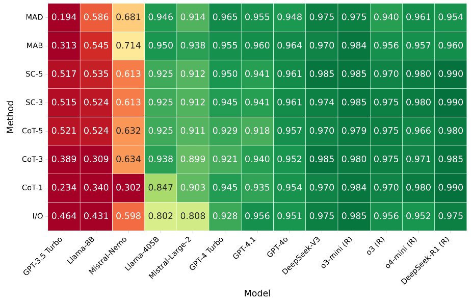

# Benchmarking Contextual Understanding for In-Car Conversational Systems

This repo hold the dataset of the paper “Benchmarking Contextual Understanding for
In-Car Conversational Systems”. The dataset is used to analyse LLM-based judgement for different large language models and various prompting techniques.

## Dataset
The dataset is licensed under the accompanied license.

## Leaderboard

In the following you can see an overall performance of LLM-based judgement techniques and models on the benchmarking dataset:

<p align="center">
  
</p>

More results you can find in the paper.

When using the dataset our refernce to our results please cite the paper as follows.

```python
TODO
````
